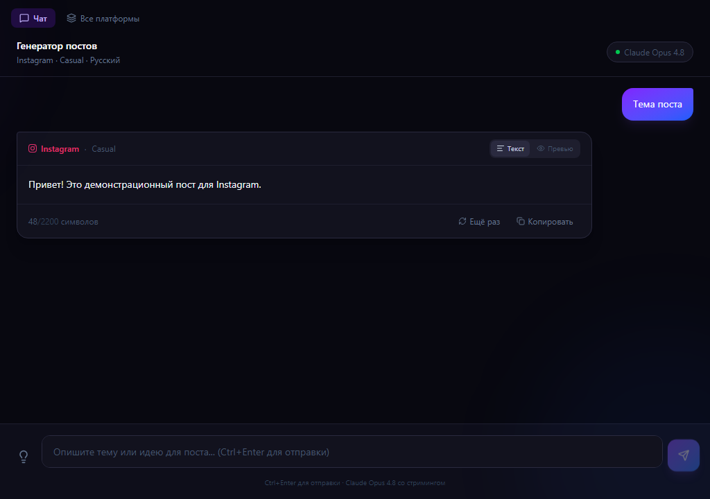

# PostCraft AI

> AI-powered social media post generator with real-time streaming via Claude.

[](https://github.com/VaskaBzh/PostCraft-AI/actions/workflows/ci.yml)
[](https://nextjs.org/)
[](https://www.typescriptlang.org/)
[](https://nodejs.org/)
[](LICENSE)

---



---

## Features

- **6 platforms** — Twitter/X (280), Instagram (2 200), LinkedIn (3 000), Facebook, TikTok, Telegram
- **5 tones** — professional, casual, humorous, inspirational, bold
- **3 length presets** — short (1–3 sentences), medium (3–7), long (7+)
- **Hashtag & emoji toggles** — Claude adds them only when enabled
- **Language selector** — generate posts in any language
- **Real-time streaming** — text streams character-by-character as Claude generates
- **One-click copy** — copy the finished post directly from the chat bubble
- **Regenerate** — re-run the same prompt with one click
- **Adaptive thinking** — uses `claude-opus-4-8` with extended thinking for higher-quality output
- **Session history** — conversation context kept for the session (cleared on page reload)

---

## Quick Start

```bash
# 1. Clone the repository
git clone https://github.com/VaskaBzh/PostCraft-AI.git
cd PostCraft-AI

# 2. Install dependencies
npm install

# 3. Set up environment
cp .env.example .env.local
# Edit .env.local and add your Anthropic API key:
# ANTHROPIC_API_KEY=sk-ant-...

# 4. Start the development server
npm run dev
```

Open **http://localhost:3000** in your browser.

### Getting an API Key

1. Go to [console.anthropic.com](https://console.anthropic.com)
2. **API Keys → Create Key**
3. Copy the key (starts with `sk-ant-api03-...`)
4. Paste it into `.env.local`

---

## Tech Stack

| Layer      | Technology                      | Version |
| ---------- | ------------------------------- | ------- |
| Framework  | Next.js App Router              | 16      |
| Language   | TypeScript                      | 6       |
| Styles     | TailwindCSS                     | v4      |
| Animations | Framer Motion                   | 12      |
| State      | Zustand (persisted)             | 5       |
| Icons      | Lucide React                    | 1.17    |
| AI         | Anthropic SDK + Claude Opus 4.8 | 0.104   |
| Unit tests | Vitest + Testing Library        | 4       |
| E2E tests  | Playwright                      | 1.60    |
| CI/CD      | GitHub Actions + Vercel         | —       |

---

## How It Works

```
User input
    ↓
ChatInput component
    ↓
useStreamingGenerate hook  →  POST /api/generate
                                      ↓
                              Next.js Route Handler
                              (server-side, API key never leaves server)
                                      ↓
                              Anthropic SDK
                              claude-opus-4-8 · thinking: adaptive
                                      ↓
                              ReadableStream → chunks
                                      ↓
                              Zustand store → updateLastMessage()
                                      ↓
                          MessageBubble renders in real time
```

The API key lives only in `.env.local` and is read server-side inside the Route Handler — it is never sent to the browser.

---

## Scripts

```bash
npm run dev           # dev server at http://localhost:3000
npm run build         # production build
npm run start         # start production server
npm run lint          # ESLint check
npm run test          # run unit tests
npm run test:coverage # unit tests with coverage report (≥80% threshold)
npm run e2e           # Playwright end-to-end tests
```

---

## Docs

- [Getting Started](docs/getting-started.md) — setup, first generation, manual testing
- [Configuration](docs/configuration.md) — platforms, tones, system prompt
- [Architecture](docs/architecture.md) — folder structure, data flow, dependency rules
- [Branch Protection](docs/branch-protection.md) — Git Flow, branch rules, CI requirements
- [Architecture Decision Records](docs/adr/README.md) — key technical decisions

---

> One post generation ≈ 300–800 input tokens + 100–500 output tokens with Claude Opus 4.8 → **< $0.01** per post.
